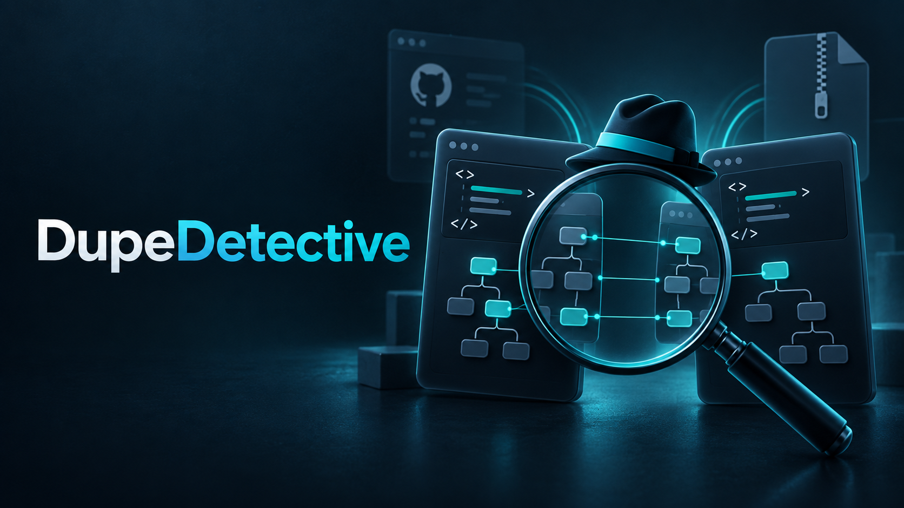

# DupeDetective


Find and review similar React components in a codebase.



[Hackathon slides (PDF)](public/dupe-detective-hackathon.pdf) · [Hackathon demo (video)](docs/dupe-detective-hackathon.mp4)

## What it does

DupeDetective scans a public GitHub repository or a ZIP archive for similar React components. It uses deterministic, AST-based analysis — no AI — to group candidates and explain the evidence. A reviewer inspects the code, tries best-effort component previews, records a decision, and generates a merge backlog and agent instructions.

## Quick start

```bash
npm install
npm run dev        # development server at http://localhost:5173
npm run build      # production build
npm run typecheck  # type-check only
```

## Scan inputs

- **GitHub URL** — enter any public repository URL (`https://github.com/owner/repo`). An optional branch or commit can be specified; defaults to the repository's default branch. The resolved commit SHA is recorded with the scan.
- **ZIP upload** — drag and drop or select a `.zip` archive of a project source tree. Path traversal entries are rejected; `node_modules`, `dist`, and other vendor directories are skipped automatically.

## How similarity works

Components are analyzed with five deterministic signals, each weighted independently:

| Signal | Weight |
|---|---|
| JSX element tree (tags + count) | 35 |
| Prop name overlap | 25 |
| Nesting depth match | 10 |
| Event handler overlap | 15 |
| Shared class names | 10 |
| Component name similarity | 5 |

Exported components are scored in pairs. A token that appears in many components counts for less than a rare one. Components join a group while the average score between clusters stays at 28 or above. A group's score is the average of every pair inside it, including weaker links. 40 or higher is Strong; below that, a group is Possible. Scores are review-ordering hints, not probability or duplicate verdicts.

The review queue starts at 28, which lists every group. Raise the minimum to 40 or 50 to hide lower-scoring groups. The filter never changes a group's membership or the scope of its decision.

## Review decisions

| Decision | Requires a note | Creates backlog item |
|---|---|---|
| Merge (all or some members) | Yes, plus the component to keep | Yes |
| Keep separate | No | No |

Each candidate group gets one decision. Choose the component to keep, which of the others merge into it, and which stay separate. Pair comparisons are evidence only. Decisions are scoped to the current scan; a new scan starts with no prior decisions.

## Generated outputs

All outputs are generated within the website for the current scan:

- **Backlog** — Markdown listing merges with status and next steps (copy from the UI).
- **Agent instructions** — Copyable repair instructions for each merge, individually or combined.

## Component preview

The preview renders components in a sandboxed `<iframe>` using React 18 (loaded from unpkg) and Babel Standalone. It cannot access the main app's cookies, storage, or APIs. Imports are stripped before rendering; if a component relies on project-specific imports, a clear error is shown and source comparison remains available.

Mock props are generated from declared prop types using deterministic heuristics (string → text input, boolean → toggle, union literals → select, callbacks → stubs).

## Architecture

```
src/
  lib/
    parser.ts     — Babel AST component discovery
    scorer.ts     — Deterministic similarity scoring and candidate grouping
    fs.ts         — ZIP extraction and GitHub archive fetching
    mockProps.ts  — Mock prop generation from prop types
    outputs.ts    — Markdown backlog and agent instruction generators
    scan.ts       — Scan orchestration (ZIP and GitHub)
  store/
    index.ts      — Zustand store (scans, decisions, per-scan state)
  types/
    index.ts      — All domain types
  pages/
    ScanInputPage.tsx      — GitHub URL / ZIP upload form
    ScanWorkspacePage.tsx  — Review queue, components list, outputs
  components/
    review/ReviewPanel.tsx        — Pair evidence and component comparison
    review/GroupReviewPanel.tsx   — Group navigation + decision sheet
    preview/ComponentPreview.tsx  — Sandboxed iframe preview + mock prop controls
    outputs/OutputsPanel.tsx      — Backlog and agent instructions
    ui/index.tsx                  — Shared UI primitives
```

## Demo plan

1. Open the app and enter a public React repository URL.
2. Wait for the scan to complete. Inspect candidate groups and match evidence.
3. Open a group, compare pairs, adjust mock props, and view previews and source side-by-side.
4. Record one **Merge** decision for the group, choose the component to keep, add a note, and save.
5. Go to **Outputs → Agent Instructions**, copy the instruction.
6. In the Backlog tab, mark the merge **Complete** with an optional note.
7. Click **New Scan** — verify the new scan starts with no prior decisions.

## Security

- Scanned source is never written back to any repository.
- Preview runs in a sandboxed iframe (`sandbox="allow-scripts"`) with no access to the main app.
- ZIP archives are validated: path traversal entries and oversized files are rejected.
- Only public GitHub repositories are supported.
